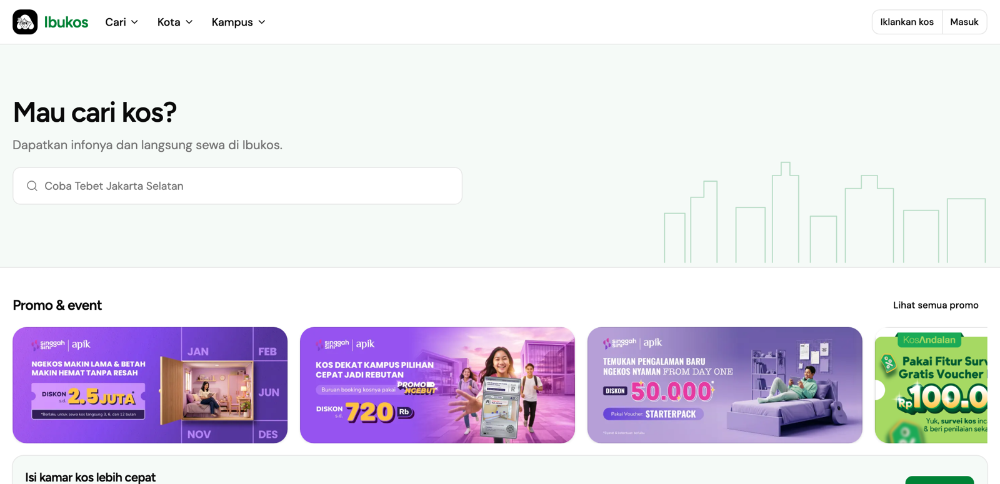
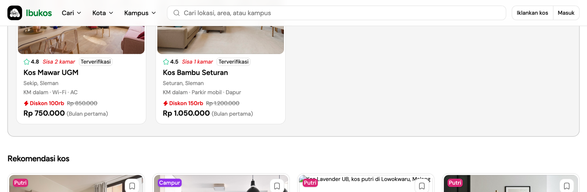
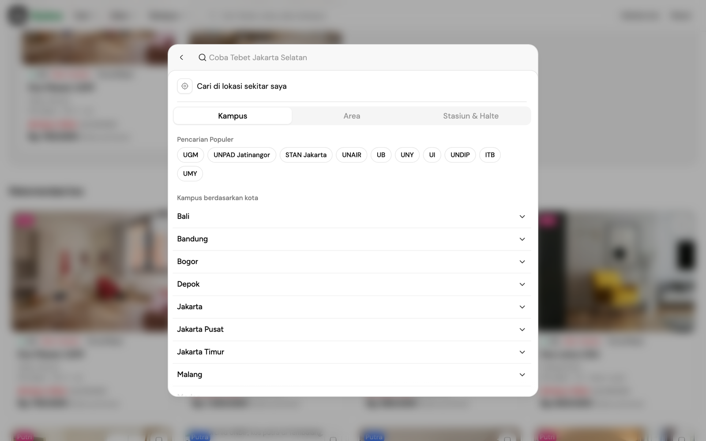
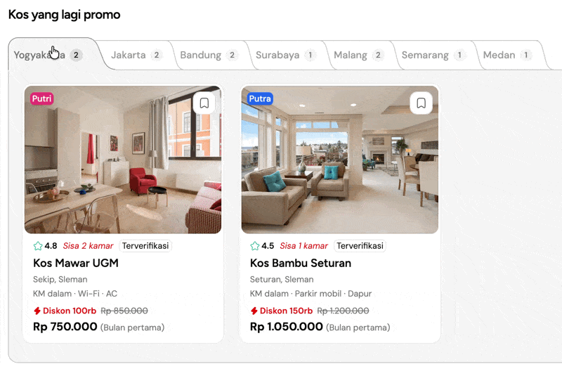
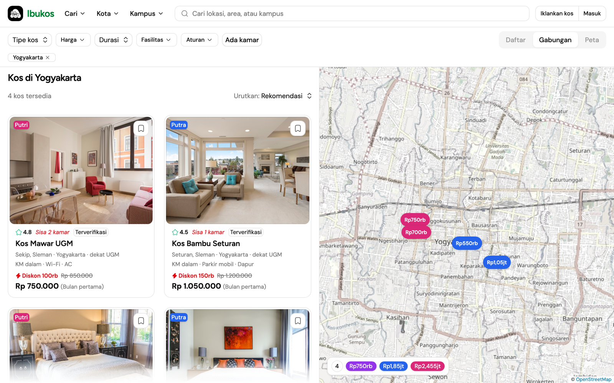
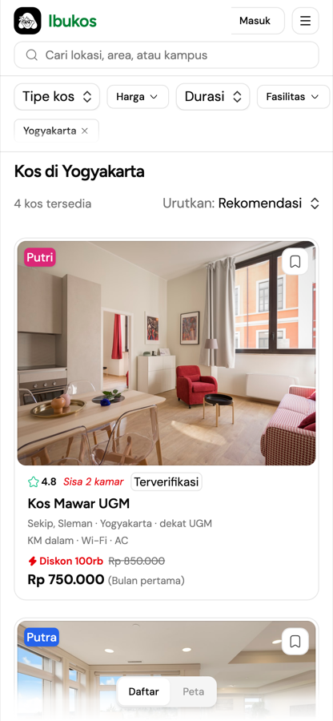
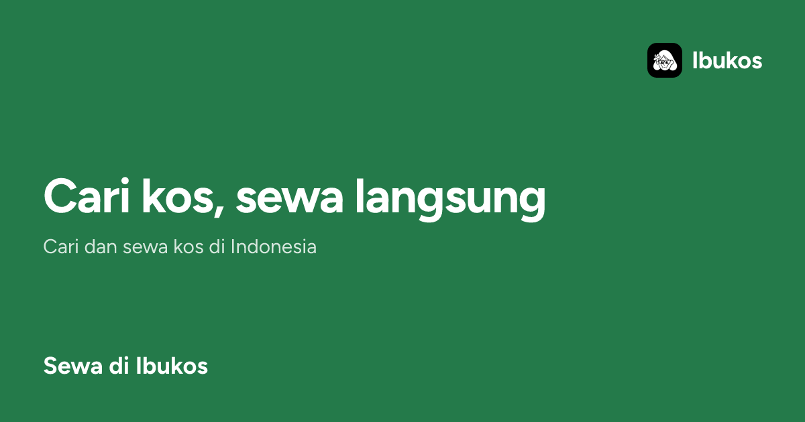
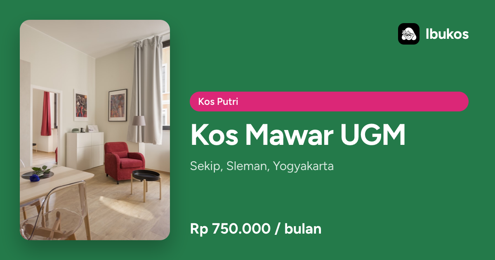
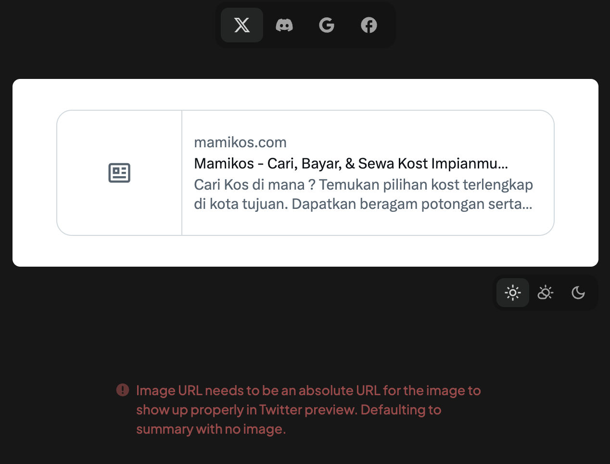

# Ibukos

A Mamikos-style kos (boarding house) finder, built for a frontend take-home that asks one thing: how well can you use AI to ship an interface? The brief is in [task.md](./task.md). The minimum was the home page. I went further because the search page had the interesting decisions.

- Demo: [ibukos.yfyx.dev](https://ibukos.yfyx.dev)
- Screen recording: [Submission for Mamikos Frontend Engineer Task](https://www.youtube.com/playlist?list=PLSQAzGocc_rg)
- Stack: [TanStack Start](https://tanstack.com/start) (React 19, SSR), [Tailwind v4](https://tailwindcss.com), [coss](https://coss.com/ui) and [shadcn](https://ui.shadcn.com) components on [Base UI](https://base-ui.com), [Leaflet](https://leafletjs.com), [Bun](https://bun.sh), [Turborepo](https://turborepo.dev), [Biome](https://biomejs.dev)



## What's here

Everything is in Indonesian, like the original. Listing data is hardcoded in `apps/web/src/domain/kos/catalog.ts` (30 kos, 7 cities), so there is no backend.

| Route                                                                  | What it does                                                                                                                                                                                                                                                                              |
| ---------------------------------------------------------------------- | ----------------------------------------------------------------------------------------------------------------------------------------------------------------------------------------------------------------------------------------------------------------------------------------- |
| `/`                                                                    | Home. [Command palette](https://en.wikipedia.org/wiki/Command_palette) search in the hero, promo folders by city, featured listings, popular areas and campuses, owner banner, footer with a dark mode switch.                                                                            |
| `/cari`                                                                | Search. Zumper-style split list and map. A [segmented control](https://developer.apple.com/design/human-interface-guidelines/segmented-controls) picks List / Split / Map on desktop; a floating one picks List / Map on mobile. Filters, sort, and committed map bounds live in the URL. |
| `/kos/$slug`                                                           | Listing detail. Photo carousel, facts, facilities, rules, an availability form with a date picker, a location map.                                                                                                                                                                        |
| `/kota/$city`, `/kota/$city/$gender`, `/kampus/$slug`, `/tipe/$gender` | [Programmatic landing pages](https://ahrefs.com/blog/programmatic-seo/) generated from the catalog. Each links into `/cari`.                                                                                                                                                              |
| `/og/*`, `/sitemap.xml`, `/robots.txt`                                 | [Open Graph](https://ogp.me) images rendered with [Takumi](https://takumi.kane.tw/), plus the crawler files.                                                                                                                                                                              |

`/login` and `/dashboard` are [Better-T-Stack](https://better-t-stack.dev) scaffold leftovers. [Better Auth](https://www.better-auth.com) is wired in with no database, so they do nothing useful. Removing them wasn't worth the time.

## Interactions worth a look

Screenshots are from Playwright against the dev server at 1280px and 390px. The script lives outside the repo; the stills are in `docs/screenshots/`.

### The search box moves into the header

Scroll past the hero and the search box reappears in the header. The browser animates the move. This is a [shared element transition](https://developer.chrome.com/docs/web-platform/view-transitions/same-document) on the [View Transitions API](https://developer.mozilla.org/en-US/docs/Web/API/View_Transition_API), driven by React's [`<ViewTransition>`](https://react.dev/reference/react/ViewTransition).

| Hero                                           | Docked                                                       |
| ---------------------------------------------- | ------------------------------------------------------------ |
|  |  |

In `apps/web/src/components/search/search-dock.tsx`:

- Both spots render `LocationSearchSlot`, which wraps `LocationSearch` in `<ViewTransition name="location-search" share="morph">`. One name in two places tells the browser it is the same element before and after.
- `useHeroSearchSentinel` watches a sentinel under the hero with an [`IntersectionObserver`](https://developer.mozilla.org/en-US/docs/Web/API/Intersection_Observer_API). Its `rootMargin` is the live header height, kept in `--site-header-height` by a [`ResizeObserver`](https://developer.mozilla.org/en-US/docs/Web/API/ResizeObserver) in `site-header.tsx`. "Out of view" means "under the header".
- The flip has [hysteresis](https://en.wikipedia.org/wiki/Hysteresis): dock at 15% visible, undock at 60%. Without the gap it flickers when you stop at the edge.
- The state change runs in [`startTransition`](https://react.dev/reference/react/startTransition), so React calls [`document.startViewTransition`](https://developer.mozilla.org/en-US/docs/Web/API/Document/startViewTransition). The `.morph` rules in `index.css` set `--duration-move` and `--ease-in-out` on the group, clip the corners, and cross-fade old and new with `object-fit: none; object-position: left center` so the placeholder text doesn't stretch.
- The header has `view-transition-name: site-header` with `animation: none`, so it holds still above the moving box.
- [`prefers-reduced-motion`](https://developer.mozilla.org/en-US/docs/Web/CSS/@media/prefers-reduced-motion) swaps in place with no animation. Cmd+K opens the dialog with a zero-duration scale.

### The search dialog



A coss [`Command`](https://coss.com/ui/docs/components/command) dialog on Base UI's Autocomplete. Empty state is a browse panel: "Cari di lokasi sekitar saya" (geolocation, snapped to the nearest catalog city), popular campuses as chips, then Kampus / Area / Stasiun & Halte tabs with a city accordion under each. Typing filters. Enter with free text goes to `/cari?q=`. On phones the dialog is full-screen.

### Save chip


A Base UI `Toggle` persisted to [`localStorage`](https://developer.mozilla.org/en-US/docs/Web/API/Window/localStorage). On save the chip widens, "Disimpan" slides out from the icon, holds 1.4s, collapses over 200ms. On remove there is no text; the icon lifts out over 550ms. Both write to an [`aria-live`](https://developer.mozilla.org/en-US/docs/Web/Accessibility/ARIA/Reference/Attributes/aria-live) region. Same chip on cards, promo folders, and the detail page.

### Promo folder tabs



The geometry is from Emil Kowalski's [Next.js Dev Tools notch](https://devouringdetails.com/prototypes/nextjs-dev-tools). You can't draw an S-curve corner in CSS. His fix is to export the tail as SVG from Figma and glue it to a normal HTML box, so the label can grow without breaking the curve. I used the same trick on "Kos yang lagi promo". Seven city tabs have to look like one folder, and the count expands when the city is active.

Each city is a `FolderNotch`. The HTML box holds the name and count. An SVG S-curve (the same 60×42 path as the Next.js overlay) is glued to the right, and the next city overlaps that tail by 16px so the top stroke looks continuous. The active city fills in, gets a darker outline, rises 4px, and grows a longer S on the right. If it isn't first, a mirrored S appears on its left, and the city before it hides its own tail so the two curves don't meet in a valley. The neighbour's top line over each crook is HTML, pinned to the row top, so it stays put when the active city rises.

Switching cities changes widths, overlaps, and which tails exist. Labels must not stretch while that happens. `useFlip` runs [FLIP](https://aerotwist.com/blog/flip-your-animations/). It snapshots every `[data-flip]` node before the state change, inverts the delta with `translate` and `scale` after layout, and plays back to identity in 200ms. Boxes marked `data-flip="x"` only slide; the fill and tails are the parts that stretch. Mid-flight switches cancel the running animations and snapshot from the visual position, so you can spam the tabs without a jump. The cards fade in with `@starting-style`. The count is `tabular-nums` so "2" and "1" don't shove the name around.

The twenty messages in the session were almost all this geometry. Red rulers on screenshots, "still a gap," me dictating which tail to hide.

### Search page: list, map, and the toggle

| Desktop split                                  | Mobile                                                                |
| ---------------------------------------------- | --------------------------------------------------------------------- |
|  |  |

- Daftar / Gabungan / Peta is a `ToggleGroup`. `commitView` in `cari/workspace.tsx` wraps the state change and the navigate in `startTransition`, tagged with [`addTransitionType("cari-view")`](https://react.dev/reference/react/addTransitionType). The `cari-list` and `cari-map` `ViewTransition`s map that type to `.layout`, so the panes resize over `--duration-move` and nothing else animates. Every other update is `default="none"`.
- Pins are Leaflet [`DivIcon`](https://leafletjs.com/reference.html#divicon)s showing price, colored by gender with the same chip classes as the cards. Card hover highlights the pin and pin hover highlights the card through one `useReducer` in `domain/cari/highlight.ts`. Clicking a pin scrolls its card into view.
- Panning does not re-query. "Cari di area ini" commits the current bounds to the URL as `bounds=`, so back and forward work.
- Under 64rem the split collapses to a list with a floating Daftar / Peta control. `domain/cari/layout.ts` resolves what `view=split` means on a narrow viewport.

### Listing detail


[Embla](https://www.embla-carousel.com) carousel with a thumbnail strip and a "Lihat semua" count. With a mouse, the next arrow is hidden until you hover the image, then fades in as a full-height gradient at the edge. It unmounts on the last slide rather than rendering disabled. On touch it stays visible, and you can swipe. The sticky action card has the price, an availability form with a date picker, WhatsApp, copy link, and report.

## Running it

```bash
bun install
bun run dev        # http://localhost:3001
```

```bash
bun test apps/web/src   # 25 unit tests: search, catalog, SEO
bun run check-types     # tsc across the workspace
bun run check           # Biome lint + format
bun run build
```

Create `apps/web/.env` first. Env validation fails without it, even though the UI never touches auth:

```bash
BETTER_AUTH_SECRET=any-string-at-least-32-characters-long
BETTER_AUTH_URL=http://localhost:3001
```

## How I worked with AI

Cursor was the only editor. Nearly every change went through the agent; I steered, checked the browser, and pushed back. About nine hours in one overnight session, longer than the brief's 3 to 5, mostly polishing the search page.

What worked was pointing at one element and saying what's wrong. Cursor attaches the selected DOM node to the prompt, so most messages read like "fix the fade on this still not respecting the image rounded corner" or "only show the next button when I hover the image part." One issue per message. Broad prompts like "make this less generic" got broad, generic output and three or four follow-ups.

Where the agent saved the most time:

- Scaffolding. Better-T-Stack gave me the monorepo, TanStack Start, Tailwind, Biome, and Turborepo in one command. Adding coss and shadcn components to `packages/ui` was another.
- The search page. Before touching `/cari`, the agent mapped the existing search domain (URL parsing, facets, filtering). Then four agents each proposed an architecture and a fifth scored them against my rubric, [LLM-as-a-judge](https://arxiv.org/abs/2306.05685) style. The rubric asked "does `searchListings` stay pure?" and "is the live map camera kept off the URL?" The winner shipped.
- SEO. Landing pages, JSON-LD, sitemap, and OG routes from one prompt plus a follow-up to render with Takumi.
- Tests. Search query parsing, catalog grouping, SEO page generation. I have a standing rule against tautological tests, so these check round-trips and edge cases, not that a constant equals itself.

Where it went sideways:

- The first home page was, in my words, "soulless." Nothing like Mamikos. I had it screenshot the references (Mamikos, Zumper) before redoing it. It screenshotted our own site first.
- Swapping the hero search for a Command component broke Base UI's group context, then looked worse than stock. Five rounds.
- The promo folder tab took twenty messages, mostly red rulers on screenshots and "still a gap." I ended up dictating the geometry.
- It tried to install Playwright and Chromium to check layout. I stopped it and looked myself. For pixel alignment, eyes and a ruler overlay beat automation.

### Skills and models

Counts are from the 47 Cursor transcripts for this repo.

Skills I attached by hand:

| Skill                                                                           | Times  | What it's for                                                                                    |
| ------------------------------------------------------------------------------- | ------ | ------------------------------------------------------------------------------------------------ |
| `emil-design-eng`                                                               | 26     | Emil Kowalski's rules for motion, hover states, and polish. On almost every UI prompt.           |
| `better-interface`                                                              | 19     | Cross-discipline UI review (layout, a11y, typography, color, copy). The judge after each revamp. |
| `coss-particles`, `coss`                                                        | 7      | Component patterns from the coss registry.                                                       |
| `poteto-mode`                                                                   | 4      | Orchestration that runs explore, architect, and judge agents. Used for `/cari`.                  |
| `animate`                                                                       | 3      | Picks properties, curves, and durations for a new animation.                                     |
| `tanstack-start`, `find-animation-opportunities`, `no-ai-slop`, `human-writing` | 2 each | Framework docs, motion audit, and the copy passes on the footer and this README.                 |
| `thermo-nuclear-code-quality-review`, `anthropic-art`                           | 1 each | One code review; one brand illustration I threw away for my own.                                 |

The agent also read skills on its own: `better-ui` (20), `better-layout` (16), `architect` (15), `better-accessibility` (14), and the pstack principle files (`model-the-domain`, `boundary-discipline`, `prove-it-works`, and others) that `poteto-mode` loads before nontrivial changes.

Models. The main chat ran on _TODO: main chat model_ (transcripts don't record it). For subagents the policy was cheap fast workers and one expensive judge. The 28 launches:

| Model                  | Launches | Role                                                         |
| ---------------------- | -------- | ------------------------------------------------------------ |
| Composer 2.5 Fast      | 8        | Workers: architect candidates, poteto implementation agents. |
| inherit (parent model) | 12       | Explorers and general helpers.                               |
| Grok 4.6 High          | 4        | Judge for the four `/cari` candidates, plus code review.     |
| GPT-5.6 Luna Medium    | 2        | Second-opinion workers.                                      |
| fast tier              | 2        | Read-only explorers.                                         |

### Takes

Four things I'd tell someone doing this test next week.

**Supervision is the job.** Most of the orchestration here (`poteto-mode`, `architect`, `arena`, the principle files) is lauren's [pstack](https://x.com/poteto/status/2097732320606507506). She posted part 2 of the guide the day before I started and pitched it as "the art of supervising someone smarter than you." I was skeptical of the framing and then spent nine hours living it. The agent knew Base UI's API, TanStack's `head()`, and the View Transitions pseudo-elements better than I did. What it didn't know was what a kos listing should feel like to a student on a phone at 11pm, or when a folder tab looks "off" by two pixels. My job was that second half. Neither of us ships this alone in a night, and pretending otherwise in either direction wastes time.

**Plan by pointing.** I have `grill-me` installed. Its description is "a relentless interview to sharpen a plan or design." In 181 prompts I invoked it zero times. What I did invoke, through `poteto-mode`, was `never-block-on-the-human`, which the agent read eight times and which says, roughly, stop asking and go.

That's not laziness, or not only. For UI work I don't have the plan until I see something wrong. Eight of my prompts start with "i mean." Twenty-three start with a screenshot, usually with red rulers drawn on it. An interview at 2am would have produced a confident spec for a layout I'd have rejected on sight. A wrong version I can point at costs one message. The exception is architecture. For `/cari` I did want the plan interrogated, so I had four agents propose designs and one grade them, and I wrote the rubric. Grill the structure, not the pixels.

**Verify with your eyes.** The agent kept wanting Playwright, to drive a browser and screenshot its own work. I said "lemme verify manually", or some misspelling of it, eight times, and then "never run browser again." Partly because it screenshotted the wrong site. Mostly because for alignment and motion, looking is faster than any harness it could set up, and the harness itself becomes a thing to debug. The one place automation earned its keep was the domain layer: 25 unit tests on search parsing, catalog grouping, and canonical rules, which are exactly the things eyes are bad at.

**Spend on the judge.** The model policy from the first prompt held all session: cheap fast workers write, one expensive model reads and scores. Grok only ever read. It graded four architecture candidates against the rubric and picked the one that shipped. `/cari` is the best-structured part of the repo because of that one review, and it cost a fraction of what running the whole build on the expensive model would have. If I only had budget for one expensive call, I'd spend it on the judge again.

## Decisions worth explaining

**Base UI over Radix.** coss ships shadcn-shaped components on Base UI. I wanted to try it and it held up. Every component in `packages/ui/src/components` comes from there.

**State in the URL.** On `/cari`, filters, sort, and committed map bounds are [typed search params](https://tanstack.com/router/latest/docs/framework/react/guide/search-params) validated with [zod](https://zod.dev). The live camera while panning is not. Pan, then press "Cari di area ini" to commit. Back and forward stay sane and nothing re-queries on drag.

**Leaflet as a client island.** `map-island.tsx` lazy-loads `map-canvas.tsx` on the client only, an [island](https://jasonformat.com/islands-architecture/) inside an SSR page. Nothing else imports Leaflet, so SSR stays clean and the map is swappable.

**Hashed coordinates.** The catalog has no lat/lng. `listingCoords` runs the slug through [djb2](http://www.cse.yorku.ca/~oz/hash.html) and scatters the result around a city center. Deterministic, so the map and the tests agree.

**Chrome via route metadata.** Whether a route gets the padded page shell or the full-bleed viewport is declared in [`staticData.chrome`](https://tanstack.com/router/latest/docs/framework/react/guide/static-route-data) on the route, not by checking pathnames in the root layout.

**[Skeleton screens](https://www.nngroup.com/articles/skeleton-screens/) instead of spinners.** The home page renders static sections at once and skeletons only the data-driven rows. Same for the map while Leaflet loads.

**Embla for carousels.** Most users will be on phones, and Embla's touch handling is the part I didn't want to write.

**Light by default, dark mode in the footer.** Light matches Mamikos. The header is for search and navigation, so the theme switch lives in the footer.

## SEO without Next.js

A listing site lives on search traffic, and Next.js is the default answer: Metadata API, `sitemap.ts`, `robots.ts`, `next/og`, all in the box. I picked TanStack Start anyway, for `/cari`. That page is a URL with 13 typed search params (city, gender, price range, facilities, sort, map bounds, view), and TanStack Router validates every one at the route boundary. That mattered more than free metadata helpers, and I bet the agent could rebuild the SEO layer in an hour. It took about forty minutes.

What shipped, all under `apps/web/src/domain/seo/`:

- `seoHead()` builds title, description, robots, canonical, Open Graph, and Twitter tags from one `SeoDocument`. Every route calls it from TanStack's [`head()`](https://tanstack.com/router/latest/docs/framework/react/guide/document-head-management), so meta is server-rendered on first load, not patched in by a client effect.
- [Structured data](https://developers.google.com/search/docs/appearance/structured-data/intro-structured-data) as JSON-LD: `Organization`, `WebSite` with a `SearchAction`, `FAQPage` on home, `BreadcrumbList` and [`Apartment`](https://schema.org/Apartment) with an IDR `Offer` on listings, `CollectionPage` + `ItemList` on landings.
- Landing pages at `/kota/$city`, `/kota/$city/$gender`, `/kampus/$slug`, `/tipe/$gender`. Crawlable, static-looking versions of common searches.
- A [canonical](https://developers.google.com/search/docs/crawling-indexing/consolidate-duplicate-urls) policy for `/cari`, the usual [faceted navigation](https://developers.google.com/search/docs/crawling-indexing/crawling-managing-faceted-navigation) problem. A bare search is indexable. A search that maps to a landing (city, city plus gender, a campus) gets [`noindex, follow`](https://developers.google.com/search/docs/crawling-indexing/robots-meta-tag) and a canonical to that landing, so Google sees one URL per intent instead of every filter permutation. Anything with extra filters is `noindex`.
- [`sitemap.xml`](https://www.sitemaps.org/protocol.html) (55 URLs, generated from the catalog) and `robots.txt` as server route handlers. `/login`, `/dashboard`, `/api/` disallowed.
- Open Graph images at `/og/*`. See [Open Graph images](#open-graph-images) below.
- A [web manifest](https://developer.mozilla.org/en-US/docs/Web/Progressive_web_apps/Manifest), `lang="id"`, `og:locale` `id_ID`, preconnects for Google Fonts.

The agent did most of this from one prompt ("now maximize the SEO for this site") plus the Takumi swap. I reviewed the canonical rules by hand because they're easy to get subtly wrong. Eight unit tests cover them: city-only search canonicalizes to the landing and is not indexed, bare `/cari` stays indexed, facility filters stay on `/cari` unindexed, the JSON-LD offer uses the promo price when there is one.

Missing versus Next.js: no [prerender](https://tanstack.com/start/latest/docs/framework/react/guide/prerendering) of the landings (they render per request), no [`hreflang`](https://developers.google.com/search/docs/specialty/international/localized-versions) (one language, so not yet), and no [Lighthouse](https://developer.chrome.com/docs/lighthouse) run. First things to check with real traffic.

### Open Graph images

Paste a link in WhatsApp or X and the preview card comes from [Open Graph](https://ogp.me) tags. Every indexable page points at a PNG the server renders on demand, not a file sitting in `public/`.

The routes mirror the page types:

| Route | Card |
| --- | --- |
| `/og` | Home |
| `/og/kos/$slug` | Listing |
| `/og/kota/$city` | City landing |
| `/og/kota/$city/$gender` | City plus gender |
| `/og/kampus/$slug` | Campus landing |
| `/og/tipe/$gender` | Gender landing |
| `/og/cari` | Search |

`seoHead()` picks the image URL with `ogImagePath()`. `/` maps to `/og`. Every other path gets `/og` prepended, so `/kos/kos-mawar-ugm` becomes `https://ibukos.yfyx.dev/og/kos/kos-mawar-ugm`.

Rendering lives in `domain/seo/og-response.tsx`. It loads Figtree once through Takumi's `googleFonts()`, resolves an absolute URL for `public/brand/ibukos-ibu.png` from the request origin, and passes both into `OgCard`. [Takumi](https://takumi.kane.tw/) turns the JSX into a 1200×630 PNG. I picked it over [Satori](https://github.com/vercel/satori) because it ships with the same React-to-image model and the agent already had it wired. Responses cache for an hour via [`Cache-Control`](https://developer.mozilla.org/en-US/docs/Web/HTTP/Reference/Headers/Cache-Control).

The card is `domain/seo/og-card.tsx`. I copied Mamikos's layout: full green background (`#247a4a`), white type, the ibu logo and "Ibukos" in the top right. Listing cards put the first photo on the left in a rounded frame with a shadow, the same slot Mamikos uses for its phone mockup. Text sits on the right: gender badge when it applies, title, subtitle, price. Home, city landings, and search skip the photo column.

Card data is in `domain/seo/og-model.ts`. One function per page type returns an `OgCardModel` (kicker, title, subtitle, optional badge, photo, price). Listing cards pull the first photo and promo price from the catalog.

Examples:

| Home | Listing |
| --- | --- |
|  |  |

Preview locally at `http://localhost:3001/og` or `/og/kos/kos-mawar-ugm`. To sanity-check tags and the X card, paste a URL into [check-site-meta](https://check-site-meta-alfonsusacs-projects.vercel.app).

One thing I checked while writing this: Mamikos still ships a relative `og:image` (`/assets/og/og_kost_v3.jpg`). X wants an absolute URL, so the checker drops the image and falls back to summary with no image:



Ibukos runs every image through `absoluteUrl()` in `seoHead()`, so production tags look like `https://ibukos.yfyx.dev/og`. Local dev without `VITE_SITE_URL` still emits `/og`, same failure mode, which is why the deploy script sets the origin at build time.

## What I'd do with more time

Real coordinates and a real data source. Working auth, or remove it. [Virtualize](https://tanstack.com/virtual) the `/cari` list once the catalog passes 30. And cut the promo folder earlier; fun, but twenty messages for a curve.

## Where the code is

Bun workspaces with Turborepo. One app, four shared packages.

| Path                       | What's in it                                                                                                                                                                                                                                                                                                                   |
| -------------------------- | ------------------------------------------------------------------------------------------------------------------------------------------------------------------------------------------------------------------------------------------------------------------------------------------------------------------------------ |
| `apps/web/src/routes/`     | File-based routes. `index.tsx` home, `cari.tsx` search, `kos.$slug.tsx` detail, `kota.*`, `kampus.*`, `tipe.*` landings, `og.*` images, `sitemap[.]xml.ts`, `robots[.]txt.ts`.                                                                                                                                                 |
| `apps/web/src/domain/`     | Plain TypeScript, no components (the OG card is the one JSX file). `kos/catalog.ts` holds the 30 listings. `facets/` is the `SearchQuery` type and its URL parser. `search/run.ts` is `searchListings()`. `seo/` builds meta tags, JSON-LD, sitemap, canonical rules, and OG cards. Tests sit next to the code as `*.test.ts`. |
| `apps/web/src/components/` | React, grouped by page: `home/`, `cari/`, `kos/`, `search/`, `chrome/` (header, footer, theme).                                                                                                                                                                                                                                |
| `apps/web/src/lib/`        | `saved-kos.ts` (localStorage), `motion.ts`, `auth-client.ts`.                                                                                                                                                                                                                                                                  |
| `packages/ui`              | 55 coss and shadcn components on Base UI, plus `globals.css` with the design tokens. Import as `@ibukos/ui/components/<name>`.                                                                                                                                                                                                 |
| `packages/auth`            | Better Auth config. No database.                                                                                                                                                                                                                                                                                               |
| `packages/env`             | Typed env with `@t3-oss/env-core`.                                                                                                                                                                                                                                                                                             |
| `packages/config`          | Shared `tsconfig.base.json`.                                                                                                                                                                                                                                                                                                   |
