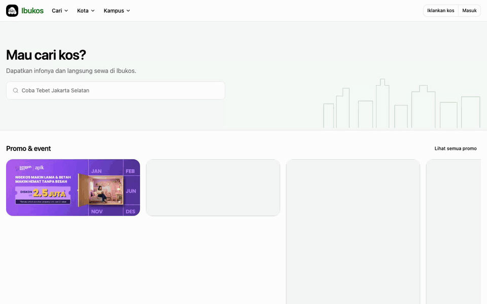
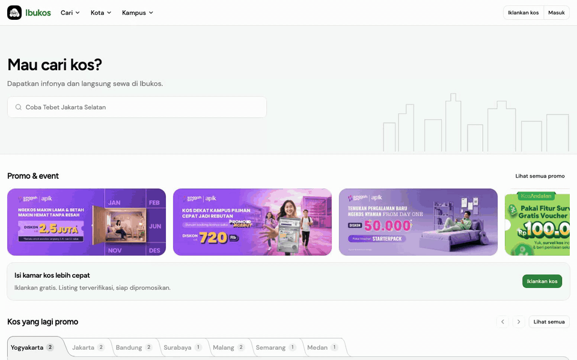
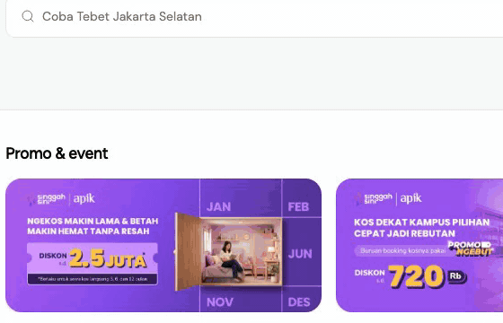
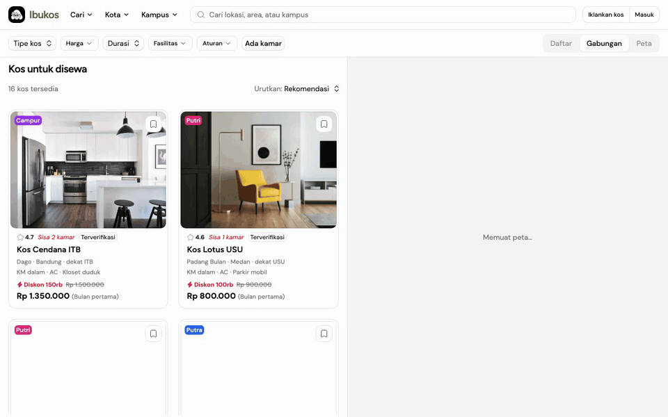
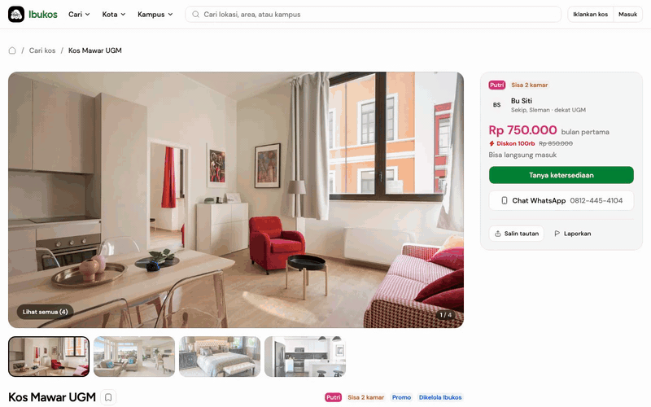
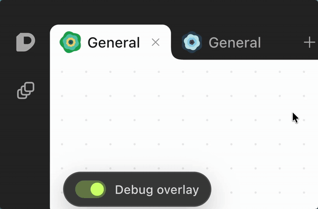

# Ibukos

A Mamikos-style kos (boarding house) finder, built for a frontend take-home that asks one thing: how well can you use AI to ship an interface? The brief is in [task.md](./task.md). Inspired by Mamikos, not a 1:1 pixel clone. The brief's expected effort is 3–5 hours of active coding; the home page alone was shippable inside that window. I went further, especially `/cari`, because the search page had the interesting decisions. Optional scope, love of the game, craft depth — not proof of failed efficiency or being slow.

- Demo: [ibukos.yfyx.dev](https://ibukos.yfyx.dev)
- Stack: [TanStack Start](https://tanstack.com/start) (React 19, SSR), [Tailwind v4](https://tailwindcss.com), [coss](https://coss.com/ui) and [shadcn](https://ui.shadcn.com) components on [Base UI](https://base-ui.com), [Leaflet](https://leafletjs.com), [Bun](https://bun.sh), [Turborepo](https://turborepo.dev), [Biome](https://biomejs.dev)

## What's here

Everything is in Indonesian, like the original. Listing data is hardcoded in `apps/web/src/domain/kos/catalog.ts` (30 kos, 7 cities), so there is no backend.

| Route                                                                  | What it does                                                                                                                                                                                                                                                                                                                                                                                               |
| ---------------------------------------------------------------------- | ---------------------------------------------------------------------------------------------------------------------------------------------------------------------------------------------------------------------------------------------------------------------------------------------------------------------------------------------------------------------------------------------------------- |
| `/`                                                                    | Home. [Command palette](https://en.wikipedia.org/wiki/Command_palette) search in the hero, promo folders by city, featured listings, popular areas and campuses, owner banner, footer with a dark mode switch.                                                                                                                                                                                             |
| `/cari`                                                                | Search. A [Zumper](https://www.zumper.com)-style [split view](https://developer.apple.com/design/human-interface-guidelines/split-views) of list and map. A [segmented control](https://developer.apple.com/design/human-interface-guidelines/segmented-controls) picks List / Split / Map on desktop; a floating one picks List / Map on mobile. Filters, sort, and committed map bounds live in the URL. |
| `/kos/$slug`                                                           | Listing detail. [Carousel](https://www.w3.org/WAI/ARIA/apg/patterns/carousel/), facts, facilities, rules, an availability form with a [date picker](https://www.w3.org/WAI/ARIA/apg/patterns/dialog-modal/examples/datepicker-dialog/), a location map.                                                                                                                                                    |
| `/kota/$city`, `/kota/$city/$gender`, `/kampus/$slug`, `/tipe/$gender` | [Programmatic landing pages](https://ahrefs.com/blog/programmatic-seo/) generated from the catalog. Each links into `/cari`.                                                                                                                                                                                                                                                                               |
| `/og/*`, `/sitemap.xml`, `/robots.txt`                                 | [Open Graph](https://ogp.me) images rendered with [Takumi](https://takumi.kane.tw/), plus the crawler files.                                                                                                                                                                                                                                                                                               |

`/login` and `/dashboard` are [Better-T-Stack](https://better-t-stack.dev) scaffold leftovers. [Better Auth](https://www.better-auth.com) is wired in with no database, so they do nothing useful. Removing them wasn't worth the time.

### The search box moves into the header

Scroll past the hero and the search box reappears in the header. The browser animates the move. This is a [shared element transition](https://developer.chrome.com/docs/web-platform/view-transitions/same-document) on the [View Transitions API](https://developer.mozilla.org/en-US/docs/Web/API/View_Transition_API), driven by React's [`<ViewTransition>`](https://react.dev/reference/react/ViewTransition).



See `apps/web/src/components/search/search-dock.tsx` and the `.morph` rules in `index.css`.

### The search dialog



A coss [`Command`](https://coss.com/ui/docs/components/command) dialog on Base UI's Autocomplete. Empty state is a browse panel: "Cari di lokasi sekitar saya" ([geolocation](https://developer.mozilla.org/en-US/docs/Web/API/Geolocation_API), snapped to the nearest catalog city), popular campuses as [chips](https://m3.material.io/components/chips/overview), then Kampus / Area / Stasiun & Halte tabs with a city [accordion](https://www.w3.org/WAI/ARIA/apg/patterns/accordion/) under each. Typing filters. Enter with free text goes to `/cari?q=`. On phones the dialog is full-screen.

### Save chip



A Base UI `Toggle` persisted to [`localStorage`](https://developer.mozilla.org/en-US/docs/Web/API/Window/localStorage). On save the chip widens, "Disimpan" slides out from the icon, holds 1.4s, collapses over 200ms. On remove there is no text; the icon lifts out over 550ms. Both write to an [`aria-live`](https://developer.mozilla.org/en-US/docs/Web/Accessibility/ARIA/Reference/Attributes/aria-live) region. Same chip on cards, promo folders, and the detail page.

### Promo folder tabs


You can't draw an S-curve corner in CSS. I learned that from Emil Kowalski's [Devouring Details notch](https://devouringdetails.com/prototypes/nextjs-dev-tools): export the tail as SVG and glue it to a normal HTML box so the label can grow without breaking the curve. I didn't drop his overlay in. I rebuilt the idea for "Kos yang lagi promo", where seven city tabs have to read as one folder.

Switching cities changes widths and overlaps. Labels must not stretch while that happens, so `useFlip` runs [FLIP](https://aerotwist.com/blog/flip-your-animations/). Mid-flight switches cancel and snapshot from the visual position, so you can spam the tabs without a jump. The cards fade in with [`@starting-style`](https://developer.mozilla.org/en-US/docs/Web/CSS/@starting-style). The count is [`tabular-nums`](https://developer.mozilla.org/en-US/docs/Web/CSS/font-variant-numeric) so "2" and "1" don't shove the name around.

The twenty messages in the session were almost all this geometry. Red rulers on screenshots, "still a gap," me dictating which tail to hide.

### Search page

| Desktop split                                                 | Mobile                                                                |
| ------------------------------------------------------------- | --------------------------------------------------------------------- |
|  |  |

Daftar / Gabungan / Peta. The panes resize; nothing else animates. Pins are Leaflet [`DivIcon`](https://leafletjs.com/reference.html#divicon)s with the price, colored by gender like the cards. Hover a card or a pin and the other highlights. Click a pin and its card scrolls into view. Panning does not re-query. "Cari di area ini" writes the bounds into the URL, so back and forward work. Under 64rem it becomes a list with a floating Daftar / Peta control.

### Listing detail



[Embla](https://www.embla-carousel.com) carousel with a thumbnail strip. On a mouse, the next arrow stays hidden until you hover the image, then fades in as a full-height gradient. It unmounts on the last slide rather than sitting there disabled. On a phone it stays visible, and you can swipe. The [sticky](https://developer.mozilla.org/en-US/docs/Web/CSS/position#sticky) card has the price, an availability form, WhatsApp, copy link, and report.

## Running it

```bash
bun install
bun run dev        # http://localhost:3001
```

```bash
bun test apps/web/src   # 25 unit tests: search, catalog, SEO
bun run check-types     # tsc across the workspace
bun run check           # Biome lint + format
bun run build
```

Create `apps/web/.env` first. Env validation fails without it, even though the UI never touches auth:

```bash
BETTER_AUTH_SECRET=any-string-at-least-32-characters-long
BETTER_AUTH_URL=http://localhost:3001
```

## How I worked with AI

Cursor was the editor until the screen recording chewed the laptop. Browser and Cursor started taking forever to open, so I switched to Cursor CLI. Nearly every change still went through the agent; I steered, checked the browser, and pushed back. About nine hours in one overnight session, mostly polishing `/cari`. The extra time is that optional stretch, not the home page missing the 3–5 hour window.

A near-1:1 home via Figma capture or a browser extension is a short path. Could be under an hour. I skipped that on purpose and spent the hours on `/cari` URL-state (typed search params) and the map island (Leaflet, client-only) instead.

What worked was pointing at one element and saying what's wrong. In the GUI, Cursor attaches the selected DOM node to the prompt, so most messages read like "fix the fade on this still not respecting the image rounded corner." One issue per message. Broad prompts like "make this less generic" got broad, generic output and three or four follow-ups.

After the CLI switch, [react-grab](https://github.com/aidenybai/react-grab) saved me the most. DEV-only import in `__root.tsx`. I clicked the broken bit in the page, copied the component context, pasted it into the CLI. Same "this corner" habit as attaching a DOM node in the GUI, except I didn't sit around waiting for Cursor to open.

Where the agent saved the most time:

- Scaffolding. Better-T-Stack gave me the monorepo, TanStack Start, Tailwind, Biome, and Turborepo in one command. Adding coss and shadcn components to `packages/ui` was another.
- The search page. Before touching `/cari`, the agent mapped the existing search domain (URL parsing, facets, filtering). Then four agents each proposed an architecture and a fifth scored them against my rubric, [LLM-as-a-judge](https://arxiv.org/abs/2306.05685) style. The rubric asked "does `searchListings` stay pure?" and "is the live map camera kept off the URL?" The winner shipped.
- SEO. Landing pages, [JSON-LD](https://json-ld.org), sitemap, and OG routes from one prompt plus a follow-up to render with Takumi.
- Tests. Search query parsing, catalog grouping, SEO page generation. I have a standing rule against tautological tests, so these check round-trips and edge cases, not that a constant equals itself.

Where it went sideways:

- The first home page was, in my words, "soulless." Nothing like Mamikos. I had it screenshot the references (Mamikos, Zumper) before redoing it. It screenshotted our own site first.
- Swapping the hero search for a Command component broke Base UI's group context, then looked worse than stock. Five rounds.
- The promo folder tab took twenty messages, mostly red rulers on screenshots and "still a gap." I ended up dictating the geometry.
- It tried to install Playwright and Chromium to check layout. I stopped it and looked myself. For pixel alignment, eyes and a ruler overlay beat automation.

### Skills and models

I ran `skilled` again. It still doesn't index Cursor (Claude Code, Codex, Droid, OpenCode, Grok CLI only), so the counts below are from the 53 Cursor chats in this repo, plus Cursor's usage events for those conversations.

Skills I attached by hand:

| Skill                                                                                                                    | Times  | What it's for                                                                                    |
| ------------------------------------------------------------------------------------------------------------------------ | ------ | ------------------------------------------------------------------------------------------------ |
| `emil-design-eng`                                                                                                        | 24     | Emil Kowalski's rules for motion, hover states, and polish. On almost every UI prompt.           |
| `better-interface`                                                                                                       | 17     | Cross-discipline UI review (layout, a11y, typography, color, copy). The judge after each revamp. |
| `no-ai-slop`                                                                                                             | 8      | Copy passes on the footer and this README.                                                       |
| `coss-particles`, `coss`                                                                                                 | 7      | Component patterns from the coss registry.                                                       |
| `human-writing`                                                                                                          | 4      | Same job as `no-ai-slop`, earlier in the session.                                                |
| `poteto-mode`                                                                                                            | 3      | Orchestration that runs explore, architect, and judge agents. Used for `/cari`.                  |
| `animate`                                                                                                                | 3      | Picks properties, curves, and durations for a new animation.                                     |
| `find-animation-opportunities`                                                                                           | 2      | Motion audit.                                                                                    |
| `tanstack-start`, `thermo-nuclear-code-quality-review`, `cloudflare`, `technical-writing`, `term-radar`, `anthropic-art` | 1 each | Docs, one code review, deploy, and a brand illustration I threw away for my own.                 |

The agent also read skills on its own: `better-ui` (17), `better-layout` (14), `better-accessibility` (12), `architect` (10), and the pstack principle files that `poteto-mode` loads before nontrivial changes.

The overnight chat, and most of the `/cari` work, ran on Cursor Grok 4.6 High. Later polish chats mixed in Composer 2.5 Fast and Auto. I asked for 21 subagent launches. 267 requests, all marked included in Pro+. Listed cost $222.40. None of it went to on-demand; Pro+ ate it. Cache reads are most of the burn, which is how these long agent threads work. Grok 4.6 High was 111 of those requests. Composer 2.5 Fast was 101.

### Takes

Four things I'd tell someone doing this test next week.

**Supervision is the job.** Most of the orchestration here (`poteto-mode`, `architect`, `arena`, the principle files) is lauren's [pstack](https://x.com/i/article/2094940651607715840). She called it "the art of supervising someone smarter than you." I was skeptical of that framing and then spent nine hours living it. The agent knew Base UI's API, TanStack's `head()`, and the View Transitions pseudo-elements better than I did. What it didn't know was what a kos listing should feel like to a student on a phone at 11pm, or when a folder tab looks "off" by two pixels. My job was that second half.

**Plan by pointing.** I have `grill-me` installed. Its description is "a relentless interview to sharpen a plan or design." I didn't want that for a UI task. Capek ditanyain, tired of being asked. In 181 prompts I invoked it zero times. What I did invoke, through `poteto-mode`, was `never-block-on-the-human`. The agent read it eight times, and it says, roughly, stop asking and go. She wrote that she plans through code, and that prototypes let agents "answer their own questions with empirical evidence instead of waiting for my input."

For UI work I don't have the plan until I see something wrong. Eight of my prompts start with "i mean." Twenty-three start with a screenshot, usually with red rulers drawn on it. Once I was on the CLI I used react-grab to grab the node instead of describing the tree. An interview at 2am would have produced a confident spec for a layout I'd have rejected on sight. A wrong version I can point at costs one message. She wrote that abstract plans "only give you the illusion of progress." The exception is architecture. For `/cari` I did want the plan interrogated, so I had four agents propose designs and one grade them, and I wrote the rubric. Grill the structure, not the pixels.

**Verify with your eyes.** She wrote that if an agent can't verify its own work, "nothing else matters. You remain the bottleneck." The agent kept wanting Playwright, to drive a browser and screenshot its own work. I said "lemme verify manually", or some misspelling of it, eight times, and then "never run browser again." Partly because it screenshotted the wrong site. Mostly because for alignment and motion, looking is faster than any harness it could set up, and the harness itself becomes a thing to debug. The one place automation earned its keep was the domain layer: 25 unit tests on search parsing, catalog grouping, and canonical rules, which are exactly the things eyes are bad at.

**Spend on the judge.** She runs competing designs through a judge on a different model, then implements against the sketch. The model policy from the first prompt held all session: cheap fast workers write, one expensive model reads and scores. Grok only ever read. It graded four architecture candidates against the rubric and picked the one that shipped. `/cari` is the best-structured part of the repo because of that one review, and it cost a fraction of what running the whole build on the expensive model would have. If I only had budget for one expensive call, I'd spend it on the judge again.

## Decisions worth explaining

**Base UI over Radix.** coss ships shadcn-shaped components on Base UI. I wanted to try it and it held up. Every component in `packages/ui/src/components` comes from there.

**State in the URL.** On `/cari`, filters, sort, and committed map bounds are [typed search params](https://tanstack.com/router/latest/docs/framework/react/guide/search-params) validated with [zod](https://zod.dev). The live camera while panning is not. Pan, then press "Cari di area ini" to commit. Back and forward stay sane and nothing re-queries on drag.

**Leaflet as a client island.** `map-island.tsx` lazy-loads `map-canvas.tsx` on the client only, an [island](https://jasonformat.com/islands-architecture/) inside an SSR page. Nothing else imports Leaflet, so SSR stays clean and the map is swappable.

**Hashed coordinates.** The catalog has no lat/lng. `listingCoords` runs the slug through [djb2](http://www.cse.yorku.ca/~oz/hash.html) and scatters the result around a city center. Deterministic, so the map and the tests agree.

**Chrome via route metadata.** Whether a route gets the padded page shell or the full-bleed viewport is declared in [`staticData.chrome`](https://tanstack.com/router/latest/docs/framework/react/guide/static-route-data) on the route, not by checking pathnames in the root layout.

**[Skeleton screens](https://www.nngroup.com/articles/skeleton-screens/) instead of spinners.** The home page renders static sections at once and skeletons only the data-driven rows. Same for the map while Leaflet loads.

**Embla for carousels.** Most users will be on phones. I didn't want to write the swipe.

**Light by default, dark mode in the footer.** Light matches Mamikos. The header is for search and navigation, so the theme switch lives in the footer.

## SEO without Next.js

A listing site lives on search traffic, and Next.js is the default answer: Metadata API, `sitemap.ts`, `robots.ts`, `next/og`, all in the box. I picked TanStack Start anyway, for `/cari`. That page is a URL with 13 typed search params (city, gender, price range, facilities, sort, map bounds, view), and TanStack Router validates every one at the route boundary. That mattered more than free metadata helpers. I bet the agent could rebuild the SEO layer in an hour. It took about forty minutes.

What shipped, all under `apps/web/src/domain/seo/`:

- `seoHead()` builds title, description, robots, canonical, Open Graph, and Twitter tags from one `SeoDocument`. Every route calls it from TanStack's [`head()`](https://tanstack.com/router/latest/docs/framework/react/guide/document-head-management).
- [JSON-LD](https://json-ld.org): `Organization`, `WebSite` with a `SearchAction`, `FAQPage` on home, `BreadcrumbList` and [`Apartment`](https://schema.org/Apartment) with an IDR `Offer` on listings, `CollectionPage` + `ItemList` on landings.
- A [canonical](https://developers.google.com/search/docs/crawling-indexing/consolidate-duplicate-urls) policy for `/cari`. A search that maps to a landing gets [`noindex, follow`](https://developers.google.com/search/docs/crawling-indexing/robots-meta-tag). Extra filters stay unindexed.
- [`sitemap.xml`](https://www.sitemaps.org/protocol.html) (55 URLs) and `robots.txt`. OG images at `/og/*`. A [web manifest](https://developer.mozilla.org/en-US/docs/Web/Progressive_web_apps/Manifest), `lang="id"`, `og:locale` `id_ID`.

I reviewed the canonical rules by hand. Eight unit tests cover them: city-only search canonicalizes to the landing and is not indexed, bare `/cari` stays indexed, facility filters stay on `/cari` unindexed, the JSON-LD offer uses the promo price when there is one.

Paste a link in WhatsApp or X and the preview card comes from Open Graph tags. Every indexable page points at a PNG the server renders on demand. I copied Mamikos's layout: full green (`#247a4a`), white type, the ibu logo and "Ibukos" in the top right. Listing cards put the first photo on the left. [Takumi](https://takumi.kane.tw/) turns the JSX into a 1200×630 PNG. I picked it over [Satori](https://github.com/vercel/satori) because it ships with the same React-to-image model and the agent already had it wired.

| Home                                          | Listing                                             |
| --------------------------------------------- | --------------------------------------------------- |
|  |  |

Mamikos still ships a relative `og:image`. X wants an absolute URL, so the checker drops the image. Ibukos runs every image through `absoluteUrl()` in `seoHead()`, so production tags look like `https://ibukos.yfyx.dev/og`.


## What I'd do with more time

Real coordinates and a real data source. Working auth, or remove it. [Virtualize](https://tanstack.com/virtual) the `/cari` list once the catalog passes 30.

The rest is continuous improvement like the promo folder.

